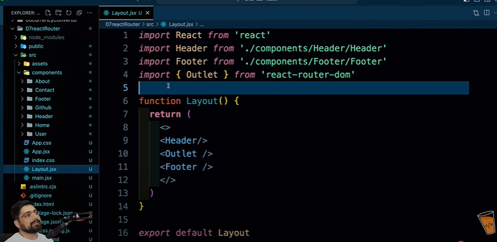
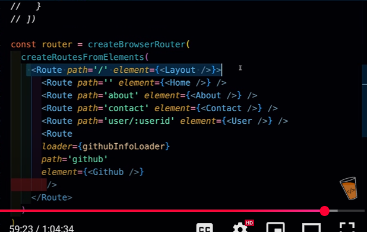
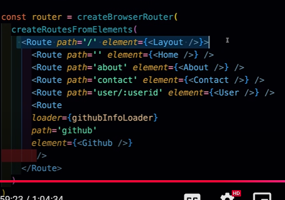
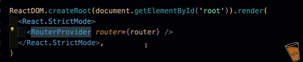

```First we will create a Outlet, a Outlet will help us to do nesting or change of pages keep the header and footer intact```

``` WE WILL CREATE A FILE CALLED Layout.jsx in src directory```



```AND NOW WE WILL GO TO main.jsx AND WE WILL DO NESTING HERE```



``` we will call createBrowserRouter and then call createRoutesFromElements and Inside of this we will makes our Routes and , Higher level route will have the layout component and then inside layout componet we will have other paths and Routes```



```NOW MAKE THE ROUTER```


