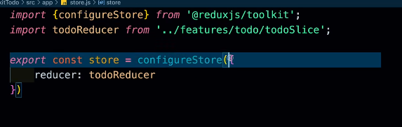
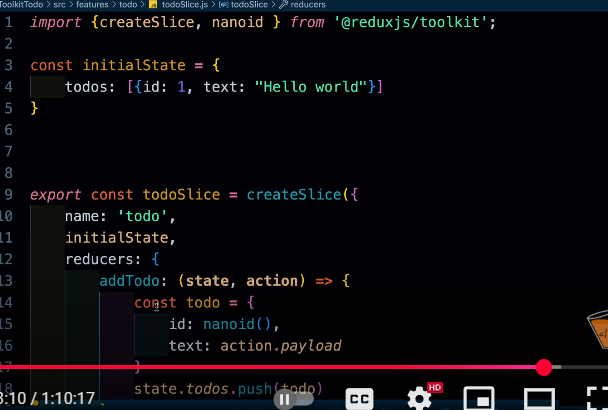
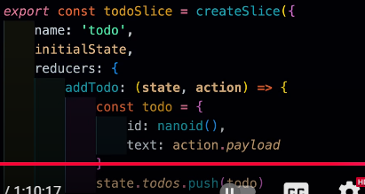
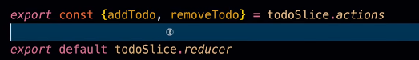

FIRST MAKE A STORE USUALLY 1 WHICH IS CALLED SINGLE SOURCE OF TROOP

WE NEED A CONFIGURE STORE

WE NEED A REDUCER 

WE SAYS FEATURES SLICE IN REDUCX

We are making a Slice in above image
for that we need 3 things 
Name
Initial State
and Reducers
And Reducer is a object which contains key-functions pairs.
EACH FUNCTIONS HAS STATE AND ACTIONS

STATE CONTAINS UPDATED STATE VALUE FROM THE STORE
ACTIONS is also a object we get lots of things from it like action.payload

THEN WE GONNA EXPORT ALL THE REDUCERS

VALUE KO BHEJNE KE LIYE HAMARE PASS HAI DISPATCH (useDispatch)

Dispatch ke ander reducer ko lana hoga

Values ko lene ke liye useSelector use karna hoga
